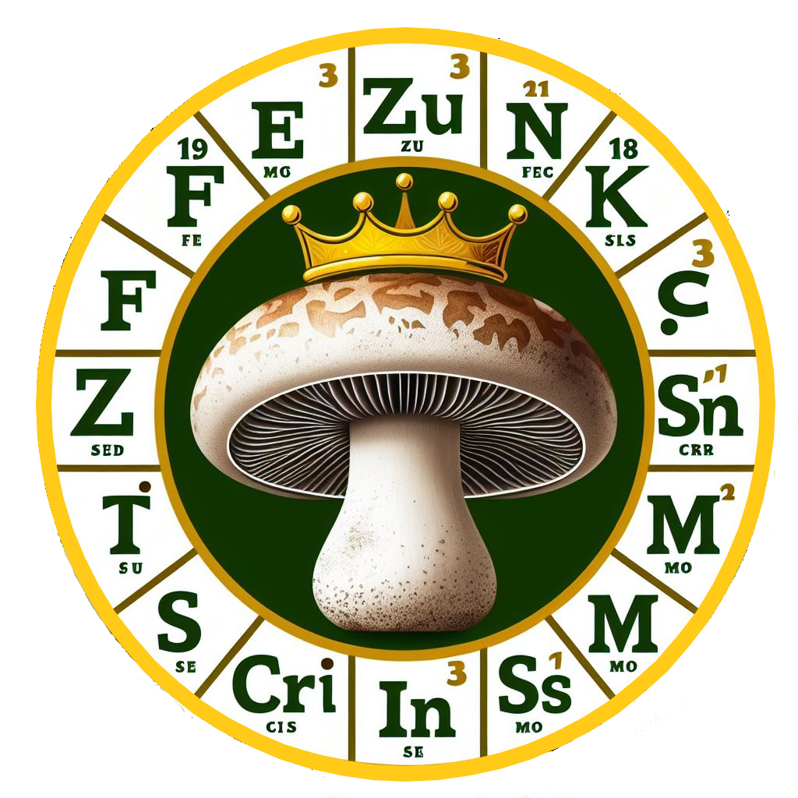
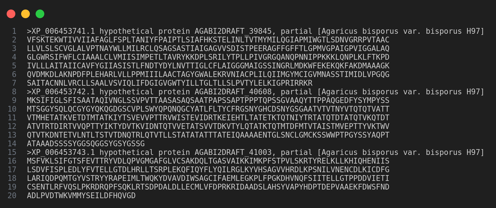

<p align="center">
  <a href="" rel="noopener">
 </a>
</p>

<h3 align="center"> 🍄 Aplicação WEB: <i>KingFungi </i>🍄</h3>

<div align="center">


</div>

---

<p align="center"> 🤖 Bem vindos, amigos pesquisadores!!
    <br> 
</p>

## 📝 Sumário

- [Sobre ](#about)
- [Exemplo de fasta](#demo)
- [Sofwares](#soft)
- [Configurações](#config)
- [Execução](#exec)
- [Autores](#authors)
- [Monografia](#monografia)
- [Referências](#acknowledgement)

## 🧐 Sobre <a name = "about"></a>
O <strong> KingFungi</strong>   é uma Aplicação Web desenvolvida pelo discente e pesquisador Sr. Reinilson Bispo de Assis Souza, como requisito para a conclusão do curso de Bacharelado em Sistemas de Informação pela Universidade do Estado da Bahia. O <strong> KingFungi</strong> tem como objetivo analisar proteomas fúngicos a partir de arquivos .fasta e identificar proteínas transmembranares com capacidade de se ligar a íons metálicos.

## Exemplo de arquivo .fasta <a name = "demo"></a>

 </a>

## 👨🏽‍💻 Sofwares  <a name = "soft"></a>


**Software 1 :**

O DeepTMHMM é um algoritmo inovador baseado em aprendizado profundo e modelo de linguagem de proteínas, que oferece uma precisão sem precedentes na detecção e previsão da topologia de proteínas transmembranares.

**Disponível em:** https://dtu.biolib.com/DeepTMHMM

**Imagem Docker:** 
```
docker pull rey4ssis/deeptmhmm:1.0
```


**Software 2 :** 

O MeBiPred (Metal Binding Predictor) também conhecido como Mymetal é uma ferramenta computacional que utiliza aprendizado de máquina para prever o potencial de ligação de metais em proteínas.

**Disponível em:** https://pypi.org/project/mymetal/

**Imagem Docker:** 
```
docker pull rey4ssis/mymetal:1.5
```


Esses são utilizados para implementar um pipeline que funcionará na aplicação web e foram criado imagens Docker para ambos os software.

## ⚙️ Configurações <a name = "config"></a>

O <strong> KingFungi</strong> foi desenvolvido utilizando Python 3.10.12 em um sistema operacional Ubuntu 22.04 64bits. Para o gerenciamento das requisições, utilizamos o Celery, que permite a execução assíncrona e escalável de tarefas em segundo plano. O RabbitMQ atua como sistema de mensagens, facilitando a comunicação eficiente e confiável entre os serviços e o Celery.

O arquivo <strong>requirements.txt</strong> possui todas as bibliotecas necessárias para a execução do <strong> KingFungi</strong>, incluindo o Celery. Instale-as utilizando o comando abaixo:

```
pip install -r requirements.txt
```
<sup>**Atenção: Certitique-se de checkar se realizou o pull do requirements.txt**</sup>


A instalação do Mebipred (Mymetal) foi identificado um problema na instalação do software, de como que a instalação via pip, não será possível, baixamos 
mymetal-1.0.9.tar.gz, disponível no Pypi e solucionamos o problema, dito isso, para instalar o software navegue até pasta **mymetal**

```
cd mymetal
```
Execute o comando:

```
pip install .
```
----
### Docker:

Para utilizar o <strong>KingFungi</strong> você terá que ter instaldo o sistema de conteinerização Docker. Para instala-lo execute os comando a baixo:

```
# Add Docker's official GPG key:
sudo apt-get update
sudo apt-get install ca-certificates curl
sudo install -m 0755 -d /etc/apt/keyrings
sudo curl -fsSL https://download.docker.com/linux/ubuntu/gpg -o /etc/apt/keyrings/docker.asc
sudo chmod a+r /etc/apt/keyrings/docker.asc

# Add the repository to Apt sources:
echo \
  "deb [arch=$(dpkg --print-architecture) signed-by=/etc/apt/keyrings/docker asc] https://download.docker.com/linux/ubuntu \
  $(. /etc/os-release && echo "$VERSION_CODENAME") stable" | \
  sudo tee /etc/apt/sources.list.d/docker.list > /dev/null
sudo apt-get update
```
Instalar a versão mais recente:
```
sudo apt-get install docker-ce docker-ce-cli containerd.io docker-buildx-plugin docker-compose-plugin
```
Verificar seu funcionamento:
```
sudo docker run hello-world
```
----
### RabbitMQ:
Além disso, para utilizar o software você terá que ter instalado o RabbitMQ. Você pode instalar de forma local no seu sistema operacional, seguindo o tutorial disponível em: https://www.rabbitmq.com/docs/install-debian ou utiliza-lo através da imagem Docker disponível no Dockerhub, com o comando abaixo: 

```
docker pull rabbitmq:latest
```


## 🏁 Execução <a name = "exec"></a>

Para executar a aplicação você está que segui exatamente os passos a segui:

- Inicie o RabbitMQ. Se optou por utilizar a imagem Docker, execute o comando abaixo:
```
docker run rabbitmq:latest
```
- Agora deve iniciar o Celery:
```
celery -A config.celery_config  worker --loglevel=info
```
E finalmente executar a aplicação:
```
python3 app.py
```

## ✍️ Autor <a name = "authors"></a>

- [@rey4ssis](https://github.com/rey4ssis) - Reinilson Bispo 
- [@G2BC](https://github.com/G2BC/KingFungi) - Grupo de Pesquisa em Bioinformática e Biologia Computacional

## Monografia <a name="monografia"></a>

## 📖 Referências <a name = "acknowledgement"></a>

- **Artigo:** https://www.biorxiv.org/content/10.1101/2022.04.08.487609v1
- **Artigo:** https://academic.oup.com/bioinformatics/article/38/14/3532/6594112?login=false


